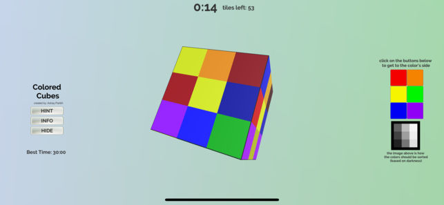

# Colored-Cubes

Order the cube from lightest to darkest! Challenging for all! [Download on the iOS app store!](https://apps.apple.com/us/app/colored-cubes/id1448642514)

## WHAT IS IT

Colored Cubes is the type of game that only 1% of the world can beat in a quick time.

## GOAL

The goal is to sort every side of the cube in order of lightest to darkest, in the fastest way possible. An image on the screen describes this in more detail.

## HOW TO PLAY

You must swap the tiles into their correct spot, and eventually get them all ordered.

## CONTROLS

You can rotate the cube by swiping, tap on two tiles to swap them, and use the buttons on the side to navigate to a specific side.

Don't worry, as there are hints and other clues to winning. But beware, as this increases your time.

## RUN GAME LOCALLY

To run the game locally, download this project and run it in [Unity](https://unity.com/). 

## CONCEPTS

- Sorting Algorithms
- 3D Rotation

